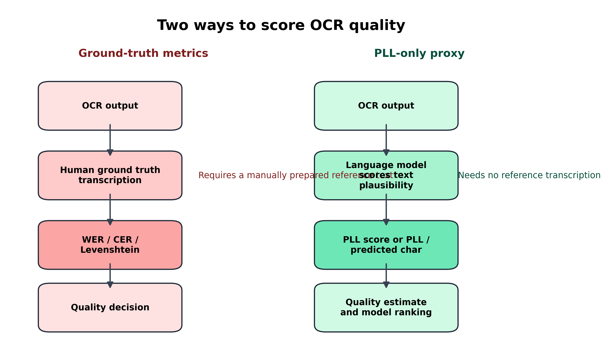
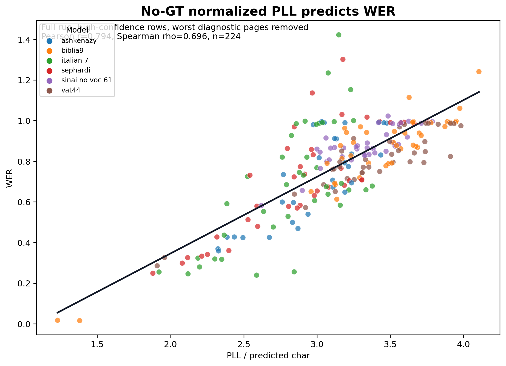
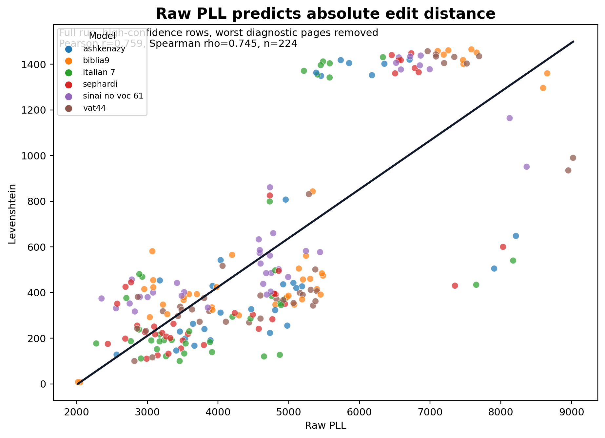
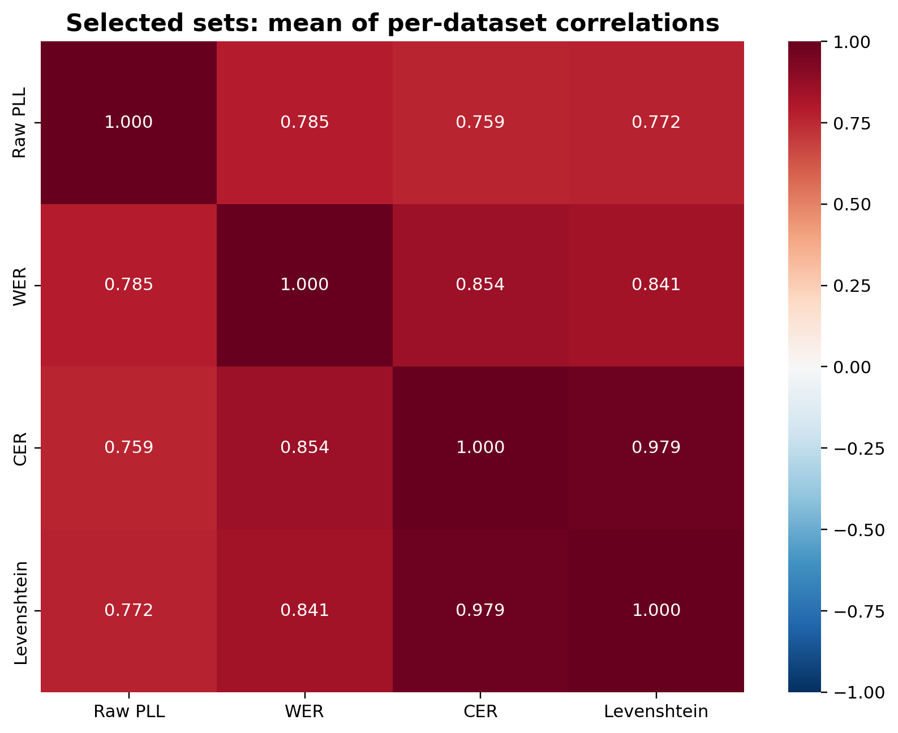
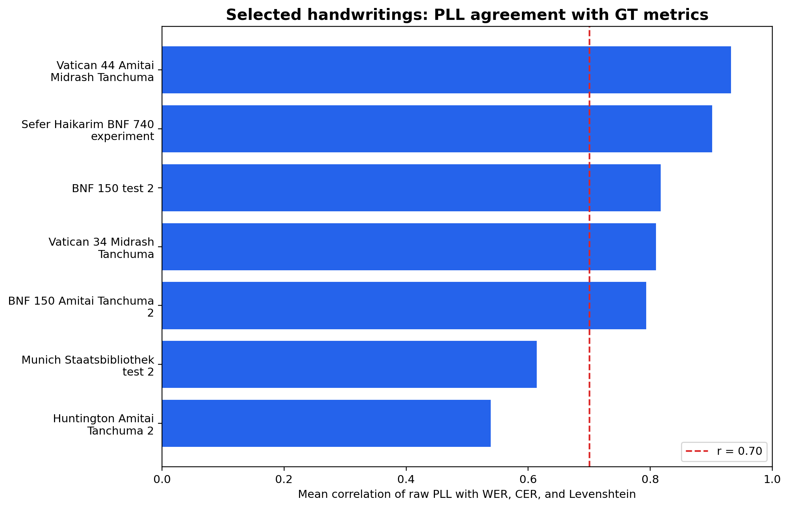
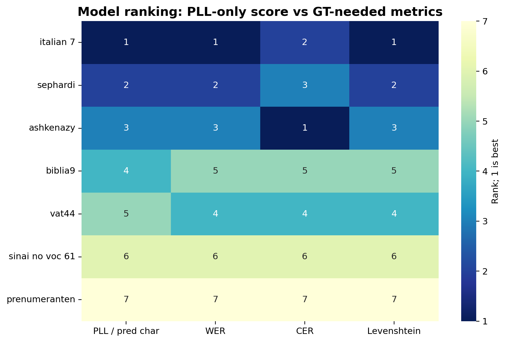
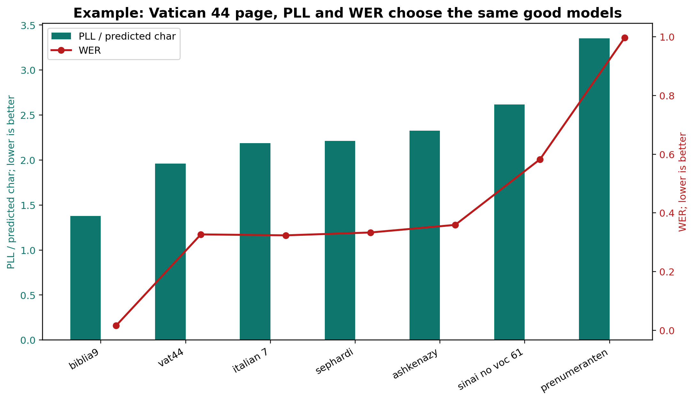
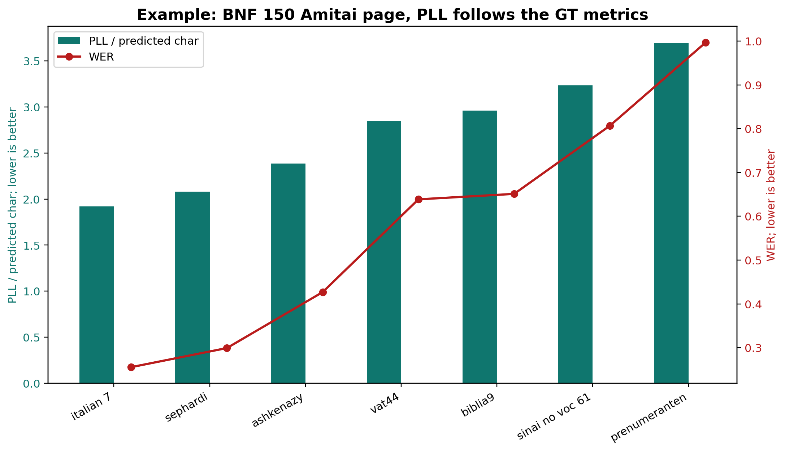
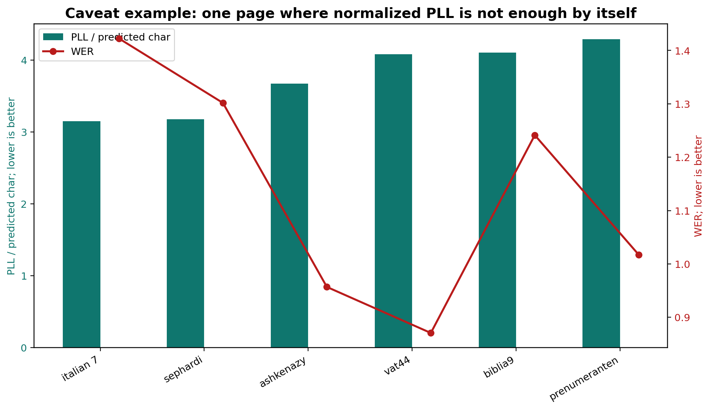

# Final PLL Proxy Report

Run: `final_run_20260617_pll_proxy`
Evidence source runs: `full_run_20260617` and `full_run_20260617_selected_handwritings`

## Main Claim

PLL scores can replace ground-truth-needed metrics for the practical task of screening OCR outputs and choosing a model when no transcription is available. They should not be described as a perfect replacement for a final benchmark, because WER, CER, and Levenshtein still measure direct agreement with human ground truth. The defensible claim is: PLL gives a strong no-GT proxy for model ranking and page-level quality estimation.

## Why PLL Can Work Without Ground Truth

WER, CER, and Levenshtein need a reference transcription. PLL does not. PLL asks how plausible the OCR text is under a language model. OCR mistakes usually create unlikely letter sequences, broken words, or impossible phrases. Those outputs receive a worse PLL score. Therefore, when several OCR models read the same manuscript page, the model with lower PLL is often also the model that would have lower WER/CER if ground truth existed.

Operationally, the no-GT scores are:

- `pll_score`: raw page PLL, best for comparing candidate models on the same page and for absolute edit burden.
- `pll_per_pred_char`: normalized by OCR output length, best for no-GT comparison across pages or datasets.

`pll_per_gt_char` and `pll_per_char_mean` are useful validation scores, but they use GT length, so they are not no-GT deployment methods.

## Evidence Summary

| Evidence | Comparison | Stat | Value | N | Interpretation |
| --- | --- | --- | --- | --- | --- |
| No-GT normalized page score | PLL / predicted char vs WER | Pearson r | 0.794 | 224 | Operational no-GT score crosses the strong-correlation threshold. |
| No-GT absolute page score | Raw PLL vs Levenshtein | Pearson r | 0.759 | 224 | Raw PLL tracks absolute edit burden. |
| No-GT absolute validation ceiling | Raw PLL vs Levenshtein | Pearson r | 0.922 | 351 | The strongest corpus-level result: PLL strongly predicts absolute GT edit distance. |
| Selected handwriting mean | Mean dataset PLL vs WER | Mean Pearson r | 0.785 | 7 | Every selected dataset gets equal weight; PLL-WER remains strong. |
| Selected handwriting mean | Mean dataset PLL vs CER | Mean Pearson r | 0.759 | 7 | The same equal-weight dataset view also supports PLL-CER. |
| Selected handwriting mean | Mean dataset PLL vs Levenshtein | Mean Pearson r | 0.772 | 7 | PLL is consistently aligned with absolute edit distance in the selected sets. |
| Selected model choice | PLL model rank vs WER model rank | Spearman rho | 0.964 | 7 | Choosing models by PLL gives almost the same ordering as choosing by WER. |
| Full model choice | PLL model rank vs WER model rank | Spearman rho | 0.857 | 7 | Model-level ranking remains strong on the broader corpus. |
| Validation-only upper bound | PLL / mean GT-pred length vs WER | Pearson r | 0.849 | 224 | This is the best normalized validation score, but it uses GT length and is not no-GT. |
| Full dataset equal-weight mean | Mean dataset PLL vs Levenshtein | Mean Pearson r | 0.697 | 11 | The full set is moderate-to-strong and just below the 0.70 threshold. |

## Key Drawings

## Selected Handwriting Mean Correlation Table

|  | Raw PLL | WER | CER | Levenshtein |
| --- | --- | --- | --- | --- |
| Raw PLL | 1.000 | 0.785 | 0.759 | 0.772 |
| WER | 0.785 | 1.000 | 0.854 | 0.841 |
| CER | 0.759 | 0.854 | 1.000 | 0.979 |
| Levenshtein | 0.772 | 0.841 | 0.979 | 1.000 |

## Examples

### Example 1: Vatican 44

On this page, the model with the best PLL / predicted character is also the model with by far the best WER, CER, and Levenshtein. This is the cleanest picture of how PLL can replace GT metrics for model choice when GT is unavailable.

| Model | Raw PLL | PLL/pred char | WER | CER | Lev |
| --- | --- | --- | --- | --- | --- |
| biblia9 | 2050.913 | 1.379 | 0.016 | 0.004 | 7.000 |
| vat44 | 2817.621 | 1.959 | 0.327 | 0.068 | 100.000 |
| italian 7 | 3264.327 | 2.186 | 0.324 | 0.082 | 121.000 |
| sephardi | 3299.005 | 2.213 | 0.333 | 0.088 | 132.000 |
| ashkenazy | 3409.072 | 2.327 | 0.359 | 0.098 | 146.000 |
| sinai no voc 61 | 3855.485 | 2.619 | 0.583 | 0.225 | 334.000 |
| prenumeranten | 5377.674 | 3.353 | 0.997 | 0.564 | 861.000 |

### Example 2: BNF 150 Amitai

This page shows the same pattern: as PLL / predicted character gets worse, WER and CER also get worse. The no-GT score recovers the same model ordering that a GT evaluation would have shown.

| Model | Raw PLL | PLL/pred char | WER | CER | Lev |
| --- | --- | --- | --- | --- | --- |
| italian 7 | 2909.984 | 1.921 | 0.255 | 0.068 | 111.000 |
| sephardi | 3146.204 | 2.079 | 0.299 | 0.076 | 125.000 |
| ashkenazy | 3535.358 | 2.386 | 0.427 | 0.125 | 198.000 |
| vat44 | 4111.537 | 2.845 | 0.639 | 0.174 | 272.000 |
| biblia9 | 4296.374 | 2.959 | 0.651 | 0.193 | 300.000 |
| sinai no voc 61 | 4602.213 | 3.234 | 0.807 | 0.341 | 527.000 |
| prenumeranten | 5136.909 | 3.690 | 0.997 | 0.633 | 986.000 |

### Caveat Example

The Munich page shows why this should be called a proxy, not a perfect replacement. On some difficult or structurally unusual pages, normalized PLL can disagree with WER. In practice, this means PLL should be used with confidence filters, page sanity checks, and occasional GT calibration.

| Model | Raw PLL | PLL/pred char | WER | CER | Lev |
| --- | --- | --- | --- | --- | --- |
| italian 7 | 2886.760 | 3.148 | 1.422 | 0.968 | 481.000 |
| sephardi | 2769.804 | 3.176 | 1.302 | 0.895 | 445.000 |
| ashkenazy | 2133.840 | 3.673 | 0.957 | 0.438 | 217.000 |
| vat44 | 2877.496 | 4.082 | 0.871 | 0.764 | 387.000 |
| biblia9 | 3083.082 | 4.105 | 1.241 | 0.897 | 454.000 |
| prenumeranten | 2346.396 | 4.290 | 1.017 | 0.788 | 400.000 |

## Recommended Use

1. For untranscribed pages, score each OCR output with `pll_per_pred_char` and choose the lowest score.
2. If comparing models on the exact same page, also inspect raw `pll_score`; it tracks absolute edit distance strongly.
3. Use OCR confidence and text-length sanity checks before trusting the score.
4. Validate once on a small GT sample; after calibration, use PLL for large-scale no-GT ranking.
5. Report the method as a no-GT proxy for ranking and screening, not as a total replacement for final GT benchmarks.

## Generated Files

- `tables/evidence_summary.csv`
- `tables/selected_model_proxy_ranking.csv`
- `tables/full_model_proxy_ranking.csv`
- `tables/selected_handwriting_proxy_correlations.csv`
- `figures/` with workflow, scatter plots, heatmaps, model ranking, and examples